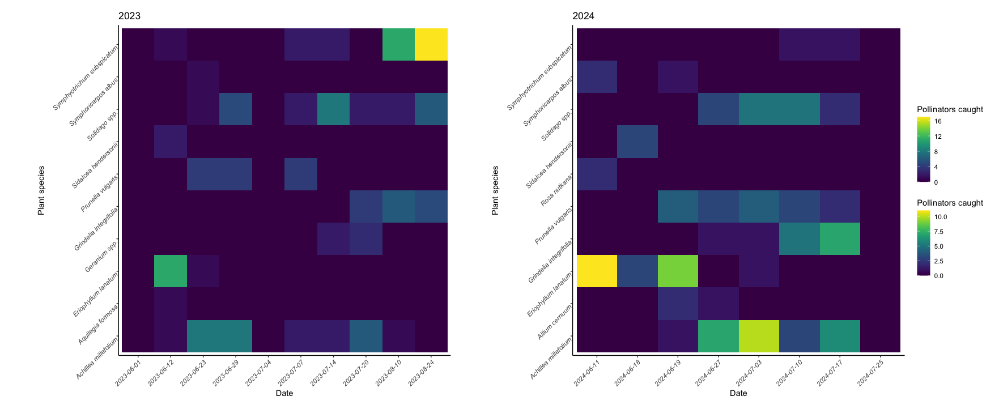

# Pollinator Insect Survey
## Contents

1. [Methods](#1-methods)  
2. [Plots](#2-plots)  
3. [Results](#3-Results)
  
A meadow in Esquimalt Gorge Park, Victoria B.C. has been seeded with native plants continually since 2020 in the hopes of attracting a greater diversity of insect pollinators. This project analyzes insects collected from this rehabilitated meadow, assesses plant-pollinator specificity, and genera abundance. Many of the contributors to this project are students or recent BSc. graduates from the University of Victoria, identifying to species (and even genus) is an ongoing process.

## 1. Methods
Insects were collected by pan traps and handnetting from a pollinator meadow in Esquimalt Gorge Park. Handnetting occurred weekly for set time intervals and pan traps were set for 48 hours every two weeks. The meadow was divided into four zones of roughly equal area, where insects were caught with a handnet in single 20 minute intervals in each zone. Insects were caught if they landed on and looked to be pollinating a flower. Three pan traps had a small amount of soap and were placed in the middle of the meadow. Three pan traps were also set in a control site, close to a parking lot, with no ecological restoration done. Pan traps were collected after 48 hours and insects were then strained and dried. Only pollinating species were kept. The first and last day of sampling were June 7 and August 18 2024, respectively.

## 2. Plots   
     
 <i>Fig 1.</i> Weekly sampling was conducted between May and August 2023 and 2024. In some weeks, the pan traps collected a large number of specimens but showed low diversity of genera among the sample. In contrast, hand-netting frequently resulted in a greater diversity but lower number of caught specimens.
   
 <i>Fig 2.</i>   The most abundant genera sampled across both 2023 and 2024 were Bombus (Bumble bees), Dianthidium (Pebble bees), Lasioglossum (sweat bees), and Andrena (mining bees). Most samples remaining to be identified to genus belong to the families Andrenidae, Crabronidae, and Halictidae. Identifying Andrenids to Andrena has proven difficult for beginner taxonomists as their characteristic facial fovea are hard to spot. It is likely most Crabronids are Philanthus, given that there is not much variation and Bee-wolves are a common iNaturalist observation. Halictids are likely Lasioglossum or Halictus, time is the remaining limiting factor to that group's identification. The number of specimens unidentified to family is quite large, and is the major focus of our identification process.
   
 <i>Fig. 3</i>
   
 <i>Fig. 4</i>

## 3. Results  
Fig 1.  
Fig 2.  
Fig 3.  
Fig 4.  
Future considerations/long-term goals of the project